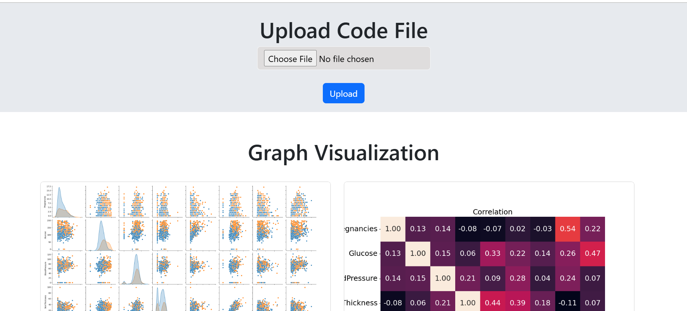

# Graph generator  🚀
 
Upload your csv file it will list the possible graph in the ui

## Table of contents
- [Features](#features)
- [Installation](#installation)
- [Usage](#usage)
- [Screenshots](#screenshots)
- [Contributing](#contributing)
- [License](#license)

## Features
- ✅ Easy to use
- 🔒 Secure
- 🚀 Fast performance


## Screenshots



## Installation
1. Clone the repository:
   ```bash
   git clone https://github.com/username/repository.git


## Contributing
Contributions are welcome! Please follow these steps:
1. Fork the repository.
2. Create a new branch (`git checkout -b feature-branch`).
3. Commit your changes (`git commit -m 'Add some feature'`).
4. Push to the branch (`git push origin feature-branch`).
5. Create a Pull Request.


## License
This project is licensed under the MIT License - see the [LICENSE](LICENSE) file for details.
